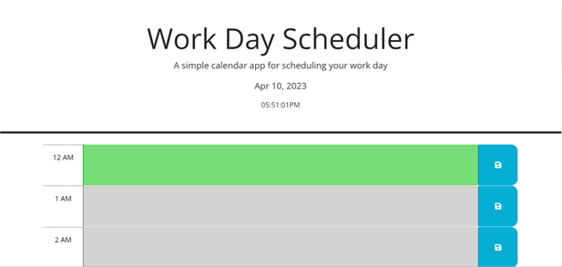

# eventcalendar

An application that enables a user to plan out their daily schedule.

## Description

The purpose of this web application is to allow the user to organize, save, and review past, present, and future items that are scheduled for any purposes.

## Usage

Upon opening the application, as the user, you'll be able to insert text in any of the time boxes
and save any planned events during the day of.

## Credit

N/A

## License

N/A